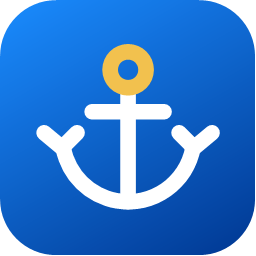
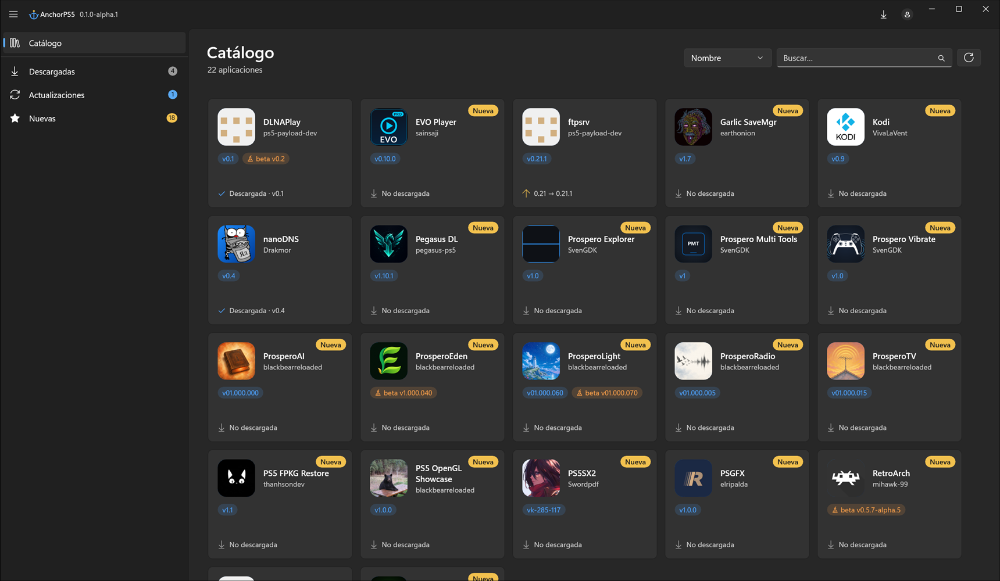
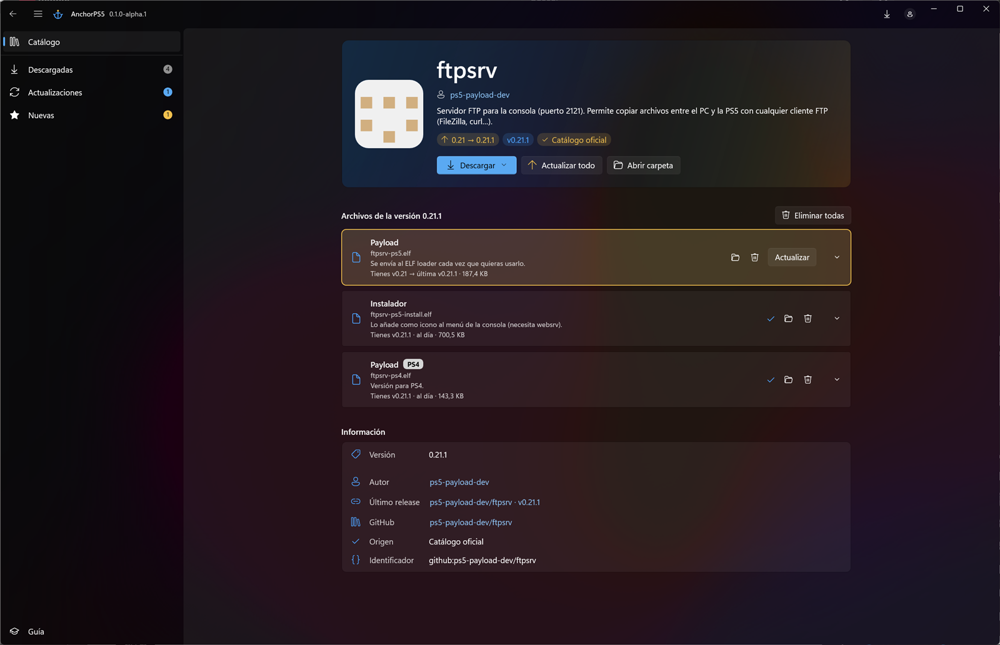
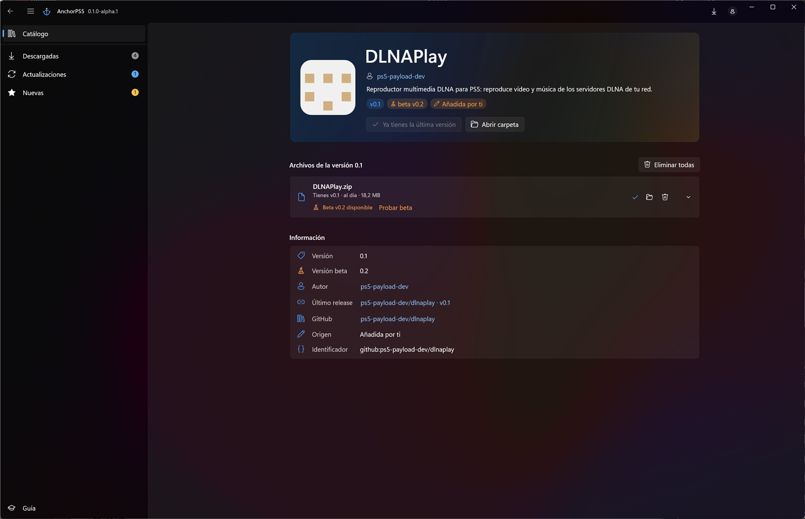

<div align="center">



# AnchorPS5

### La tienda de homebrew para tu PS5

[](CHANGELOG.md)
[](#requisitos)
[](https://dotnet.microsoft.com/)
[](LICENSE)

**[⬇️ Descargar](https://github.com/Kuroge/AnchorPS5/releases)** ·
**[📋 Novedades](CHANGELOG.md)** ·
**[📚 Catálogo](https://github.com/Kuroge/AnchorPS5-catalog)** ·
**[🌍 Traducir](#traducir-anchorps5)**

**Español** · [English](README.en.md)

</div>

---

AnchorPS5 es una app de escritorio para Windows que reúne el homebrew de PS5 en un
catálogo, lo descarga ya verificado y te avisa cuando hay versiones nuevas. Como F-Droid
o el Homebrew Browser de Wii, pero para PS5.

> ⚠️ **Versión alpha.** Funciona, pero aún está en desarrollo y puede cambiar mucho de
> una versión a otra. Mira las [novedades](CHANGELOG.md).



| Ficha de una app | Betas |
|---|---|
|  |  |

## Qué hace

- 📚 **Catálogo de homebrew** con búsqueda, orden y secciones: Descargadas,
  Actualizaciones y Nuevas.
- ⬇️ **Descargas verificadas:** cada fichero sale de la release oficial de su autor en
  GitHub y se comprueba con su SHA-256. Los `.zip`, `.7z` y `.rar` se extraen solos.
- 🔄 **Actualizaciones por fichero** (`0.1 → 0.2`) y botón **Actualizar todo**.
- 🗂️ **Historial de versiones:** guarda las versiones anteriores para volver atrás.
- 🧪 **Betas opcionales:** prueba la beta de un fichero y vuelve a la estable cuando
  quieras.
- 🏷️ Etiqueta **PS4** en los ficheros que no son para PS5.
- ➕ **Tus propias apps:** añade apps a tu copia del catálogo; se conservan cuando el
  catálogo oficial se actualiza.
- 🔑 **Inicio de sesión con GitHub (opcional)** para subir el límite de consultas de 60
  a 5000 por hora.
- 🌍 **Traducible:** todos los textos están en ficheros JSON.

## Requisitos

- Windows 10 (versión 1809 o posterior) o Windows 11, de 64 bits.
- Nada más: la app lleva todo lo que necesita (no hace falta instalar .NET).

## Instalación

1. Descarga el `.zip` de la última versión en [Releases](https://github.com/Kuroge/AnchorPS5/releases).
2. Descomprímelo en una carpeta (p. ej. `C:\AnchorPS5`).
3. Abre `AnchorPS5.exe`.

La primera vez te pide el idioma, la carpeta de descargas (por defecto
`Descargas\AnchorPS5_Downloads`) y, si quieres, tu cuenta de GitHub. Es una app
**portable**: su configuración vive en la carpeta `config` junto al `.exe`.

## El catálogo

La lista de apps está en un repo aparte,
[AnchorPS5-catalog](https://github.com/Kuroge/AnchorPS5-catalog). ¿Falta alguna? Allí
puedes proponerla desde la web de GitHub, sin saber programar.

### Añadir tus propias apps

Edita `config\catalog.json` y añade la app a la lista `apps` con el mismo formato que
las demás (está explicado en el repo del catálogo). Aparecerá marcada como
**Añadida por ti**.

## Traducir AnchorPS5

Los textos están en `lang\<idioma>.json` (de fábrica, `es.json`):

1. Copia `lang\es.json` como `lang\<código>.json` (p. ej. `en.json`).
2. Cambia `_meta` (`"code": "en"`, `"name": "English"`) y traduce los textos (no las claves).
3. El idioma aparece en la configuración inicial, o ponlo en `config\config.json`
   (`"language": "en"`).

¡Las traducciones son bienvenidas como pull request!

## Compilar desde el código

Necesitas el [SDK de .NET 10](https://dotnet.microsoft.com/download) en Windows.

```powershell
dotnet build                      # compilar
dotnet test                       # tests
dotnet publish src/AnchorPS5.App -c Release -r win-x64 --self-contained
```

Está hecho con .NET 10 y WinUI 3 (Windows App SDK). El núcleo (`AnchorPS5.Core`) no
depende de la interfaz y tiene sus propios tests.

## Créditos

- Autor: **cheyen2008** ([Kuroge](https://github.com/Kuroge)).
- [7-Zip](https://www.7-zip.org/) de Igor Pavlov (GNU LGPL), incluido para extraer los
  paquetes. Su licencia está en `tools\7zip\License.txt`.
- [Windows App SDK](https://github.com/microsoft/WindowsAppSDK) y
  [CommunityToolkit.Mvvm](https://github.com/CommunityToolkit/dotnet) (licencia MIT).
- **Huertas34**, de [elotrolado.net](https://www.elotrolado.net), por la sugerencia inicial del catálogo.
- Gracias a los autores del homebrew del catálogo: AnchorPS5 solo enlaza sus releases.

## Licencia

AnchorPS5 es software libre bajo la licencia [GNU GPL v3](LICENSE): puedes usarlo,
estudiarlo, modificarlo y compartirlo, siempre que lo que distribuyas basado en él se
publique también con la misma licencia.
